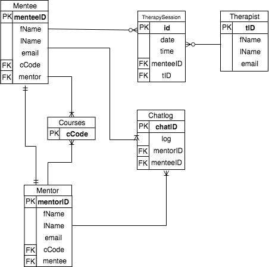
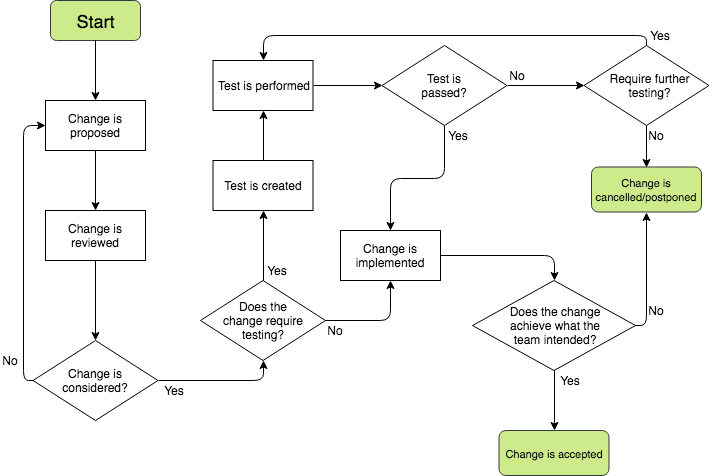
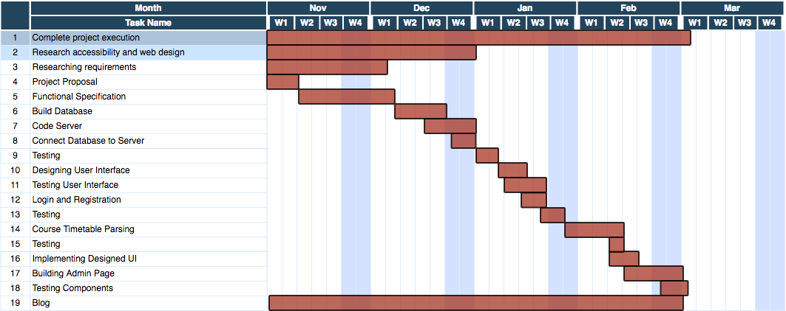

## Table of Contents

1. **Introduction**
 - 1.1 Purpose
 - 1.2 Scope
 - 1.3 Overview

2. **Overall Description**
 - 2.1 Product Perspective
 - 2.2 User Characteristics
 - 2.3. Interfaces
 - 2.4 Product Functions
 - 2.5 Constraints
 - 2.6 Assumptions and Dependancies
 - 2.7 Apportioning of Requirements

3. **Specific Requirements**
 - 3.1 External Interfaces
 - 3.2 Functions
 - 3.3 Performance Requirements
 - 3.4 Logical Database Requirements
 - 3.5 Design Constraints
 - 3.6 Software System Attributes

4. **Change Management System**

5. **Timeline**

6. **Appendices**

# 1. Introduction

### 1.1 Purpose
The purpose of this functional specification is to provide a general description of the Autism Support System, Acclimate, that we have proposed, describe it's intended capabilities and talk about the technologies we will be using to implement it. We also wish to determine the work that needs to be done early on and assign deadlines to this work.

### 1.2 Scope
Acclimate is a web application which implements an Autism Support System for DCU. The app shall have a portal to allow these students to sign in to their accounts and this portal shall be segregated depending on whether the user is a mentor or a mentee. There will also be a sign-in section for therapists.
This portal shall have a simple profile page for every member, which will include a picture, a short description of themselves and a list of some of their interests/hobbies. The picture will not be of the student themselves as this may intimidate some of the candidates, rather it will be a picture relating the student's interests/hobbies. The web app will then pair these students, mentors to mentees. The portal shall have a very simplistic and minimalistic User Interface to accommodate the user base that is on the autism spectrum. The portal shall facilitate communication between mentors and mentees by providing a chat system, allowing the pair to plan times to meet up or discuss any issues the mentee may be experiencing. There will also be an option on the mentor's dashboard which will allow them to receive, from the system, a recommended meetup time based on their timetable. Once an ideal meetup time has been determined, the mentor will have the option of sending their mentee a chat message to offer to meet at this time. Mentees will also be able to use the portal to book therapy sessions with qualified therapists, which is a service already provided by DCU for students with ASD.

### 1.3 Overview
_Section 2_ contains detailed information for the customer.
_Section 3_ contains detailed information for developers.
_Section 4_ contains information on our change management system.
_Section 5_ contains our timeline.
_Section 6_ contains our sources and supplementary reading information, as well as a glossary explaining accronyms and abreviations.

# 2. The Overall Description

### 2.1 Product Perspective
The number of students pursuing higher level education has been increasing in recent years. For this reason, there is a need for universities to provide mentorship schemes for these students to help them settle best into university life. Many universities provide a mentorship program but the one that is most similar to what our web app aims to achieve is the program provided by Curtin University, a leading Australian university with many campuses all over the world. Mentors in this mentorship program are postgraduate students from a variety of courses, including Occupational Therapy, Psycholog and Computer Science. They help to guide and support their mentee to reach their academic, employment and personal goals. The mentorship system is organized by a team of dedicated individuals who review candidate applications.
The service that Acclimate shall provide differs in a few ways. Any DCU student that has passed their first year of study and passes the randomly generated test that the portal provides for them shall be eligible to be a mentor, although we suspect the greatest interest in this program will come from students studying Occupational Therapy and Psychology. Mentors will aid students in pursuing their personal and academic goals, as well as helping them to be more comfortable socializing. It is also their responsibility to show their mentee around campus and familiarize them with the building(s) they will be studying in most frequently. The organization of this process shall all be handled by the portal, including mentor-to-mentee pairing. 

### 2.2 User Characteristics
The primary user base for the system is students studying in DCU. These students are required to use student apps such as Loop on a daily basis, so we can safely assume that they are comfortable with using web applications on both mobile and desktop platforms.
A critical subsection of our user base is students on the autism spectrum. These students have various needs and preferences when it comes to navigating a User Interface. The most critical of these requirements, that must apply to this system's UI are as follows:
- **Sensory Issues** - People on the spectrum can find cluttered webpages to be overwhelming, due to their often heightened sensory awareness.
- **Consistency** - People on the spectrum tend to need consistency throughout the UI.
- **Communication** - People on the spectrum are more likely to take things seriously and benefit from visual material.

### 2.3.1 Interfaces
Users will interact with the system through a GUI. Bearing the requirements discussed in section _2.3 - User Characteristics_ in mind, the system shall have a very minimalistic and uncluttered UI, paying  particular attention to making the portal straightforward to navigate and keeping all navigation mechanisms clear and consistent.

### 2.3.2 System Interfaces
In order to ensure that the students signing up to be mentors are in fact DCU students, our system shall interact with DCU's authentication interface. When a student wants to sign up, they shall first be redirected to a sign in of the DCU portal and, when authentication is received, they shall be allowed to sign up and their details shall be stored in the SQL database.

### 2.3.3 Hardware Interfaces
The system has no hardware interface requirements.

### 2.3.4 Software Interfaces
_16.6.3 React.js._ The system shall use the React.js library to aid in the implementation of the User Interface.

_8.0 MySQL._ MySQL shall be used as the relational database management system.

_10.14.1 Node.js._ The server shall be designed and implemented using the Node.js library.

_4.8.3 phpMyAdmin._ For our SQL server, we shall be using phpMyAdmin as an administration tool.

_2.2.0 Socket.io_ The Socket.io JavaScript library shall be used to facilitate bi-directional communication, allowing implementation of a chat system.

### 2.3.5 Communications Interfaces
The chat feature of the system will implement the websocket protocol. This will allow users to connect to the server and vice versa over a single TCP connection for low latency, bi-directional communication. The JavaScript library, Socket.io, will be used for this.

### 2.3.6 Memory Constraints
The system will be built as a web application in order to be available to as many users as possible across desktop and mobile. If the user owns a device that can access a web browser, they will come across no memory contraints.

### 2.3.7 Site Adaptation Requirements
If this system were to be adopted by DCU, the university would need to put all source code on their own servers. They would also need to provide a dedicated domain name for web identification.

### 2.4 Product Functions
   
| Use Case 1                                   | User authenticates themselves at sign up with DCU authentication system     |
| ---------------------------------------------|:---------------------------------------------------------------------------:|
| **Goal in Context**                          | User is granted permission to sign up                                       |
| **Scope & Level**                            | Primary Task                                                                |
| **Preconditions**                            | Sign up page is clicked                                                     |
| **Success End Condition**                    | User is granted permission to sign up                                       |
| **Failed End Condition**                     | User is denied permission to sign up                                        |
| **Primary Actors, Secondary Actors**      | User,  DCU Authentication system                                         |
| **Trigger**                                  | User tries to sign up to become a mentor/mentee                             |
|**DESCRIPTION**                               |                                                                             |
| **Step**                                     | **Action**                                                                  |
| 1                                            | User clicks sign up                                                         |
| 2                                            | User enters DCU login credentials                                           |
| 3                                            | User clicks enter                                                           |
| 4                                            | User is granted access to sign up                                           |
|**EXTENSIONS**                                |                                                                             |
| **Step**                                     | **Branching Action**                                                        |
| 4a                                           | DCU authentication system denies access to the user                         |

| Use Case 2                                   | User signs in to the portal                                                 |
| ---------------------------------------------|:---------------------------------------------------------------------------:|
| **Goal in Context**                          | User is granted access to their portal                                      |
| **Scope & Level**                            | Primary Task                                                                |
| **Preconditions**                            | Sign in page is clicked                                                     |
| **Success End Condition**                    | User is granted access to their portal                                      |
| **Failed End Condition**                     | User is denied access to their portal                                       |
| **Primary Actors, Secondary Actors**      | User,  Acclimate                                                         |
| **Trigger**                                  | User clicks sign in                                                         |
|**DESCRIPTION**                               |                                                                             |
| **Step**                                     | **Action**                                                                  |
| 1                                            | User enters their email address and password                                |
| 2                                            | User clicks log in                                                          |
| 3                                            | User is granted access to their portal                                      |
|**EXTENSIONS**                                |                                                                             |
| **Step**                                     | **Branching Action**                                                        |
| 3a                                           | User is denied access to their portal                                       |

| Use Case 3                                   | User sets up their profile                                                  |
| ---------------------------------------------|:---------------------------------------------------------------------------:|
| **Goal in Context**                          | User sets up their profile page with personal details                       |
| **Scope & Level**                            | Primary Task                                                                |
| **Preconditions**                            | User must be signed up and signed in to the portal                          |
| **Success End Condition**                    | User successfully sets up their profile and it is viewable by their mentor/mentee |
| **Failed End Condition**                     | User fails to set up their profile page                                     |
| **Primary Actors, Secondary Actors**      | User,  Acclimate                                                         |
| **Trigger**                                  | User signs up and is prompted to enter profile info                         |
|**DESCRIPTION**                               |                                                                             |
| **Step**                                     | **Action**                                                                  |
| 1        | User enters their hobbies/interests, a picture relating a hobby and a short description of themselves           |
| 2        | User clicks "Done"                                                                                              |
| 3        | Acclimate saves their details so that it may be formatted and displayed for them and their mentor/mentee to view |
|**EXTENSIONS** | |
| **Step** | **Branching Action** |
| 3a       | User leaves the page before setting up their profile |
| 3b       | User enters insufficient information |

| Use Case 4                                   | User views a profile page                                                   |
| ---------------------------------------------|:---------------------------------------------------------------------------:|
| **Goal in Context**                          | User wishes to view their own profile or the profile of their mentor/mentee |
| **Scope & Level**                            | Primary Task                                                                |
| **Preconditions**                            | User is signed in                                                           |
| **Success End Condition**                    | User is able to view the desired profile                                    |
| **Failed End Condition**                     | User is unable to view the desired profile                                  |
| **Primary Actors, Secondary Actors**      | User,  Acclimate                                                         |
| **Trigger**                                  | User clicks "View profile"                                                  |
|**DESCRIPTION**| |
| **Step** | **Action**                                               |
| 1        | User signs in to the portal |
| 2        | User clicks "View profile" |
| 3        | The profile is displayed correctly for the user |
|**EXTENSIONS** | |
| **Step** | **Branching Action** |
| 3a       | The profile is displayed incorrectly for the user |
| 3b       | The profile is not displayed for the user |

| Use Case 5                                   | User sends a message to mentor/mentee                                       |
| ---------------------------------------------|:---------------------------------------------------------------------------:|
| **Goal in Context**                          | User is able to send and receive messages to/from their mentor/mentee       |
| **Scope & Level**                            | Primary Task                                                                |
| **Preconditions**                            | User is signed in and clicks into the chat feature                          |
| **Success End Condition**                    | User is successfully able to send and receive messages                      |
| **Failed End Condition**                     | User is unable to send and/or receive messages                              |
| **Primary Actors, Secondary Actors**      | User,  Acclimate                                                         |
| **Trigger**                                  | User types in message and presses "Send"                                    |
|**DESCRIPTION**| |
| **Step** | **Action**                                               |
| 1        | User signs in to the portal |
| 2        | User clicks into chat feature of the portal |
| 3        | User types in message and presses "Send" |
| 4        | Message is emitted using Socket.io |
|**EXTENSIONS** | |
| **Step** | **Branching Action** |
| 4a       | User is not emitted by Socket.io |

| Use Case 6                                   | User books a therapy session                                                |
| ---------------------------------------------|:---------------------------------------------------------------------------:|
| **Goal in Context**                          | A mentee books a therapy session with a DCU therapist and this session gets logged for the therapist |
| **Scope & Level**                            | Primary Task |
| **Preconditions**                            | User is signed in and clicks into the therapy section of the portal         |
| **Success End Condition**                    | User successfully books a therapy session with a therapist                  |
| **Failed End Condition**                     | User is unable to book a therapy session with a therapist                   |
| **Primary Actors, Secondary Actors**      | Mentor,  Acclimate, Therapist                                            |
| **Trigger**                                  | User clicks on an available appointment slot                                |
|**DESCRIPTION**| |
| **Step** | **Action**                                               |
| 1        | User signs in to the portal |
| 2        | User clicks into the "Therapy" section of the portal |
| 3        | Available appointment slot is displayed |
| 4        | User clicks on appointment slot to book session |
|**EXTENSIONS** | |
| **Step** | **Branching Action** |
| 3a       | Available appointment slot is not displayed and alternative contact info for the therapist is displayed |

| Use Case 7                                   | User gets a recommended meetup time                                         |
| ---------------------------------------------|:---------------------------------------------------------------------------:|
| **Goal in Context**                          | The mentor gets a recommended meetup time to meet with their mentee         |
| **Scope & Level**                            | Secondary Task                                                              |
| **Preconditions**                            | User is signed in and clicks "Get a recommended meetup time"                |
| **Success End Condition**                    | User is given a recommended meetup time                                     |
| **Failed End Condition**                     | User is not given a recommended meetup time                                 |
| **Primary Actors, Secondary Actors**      | Mentor,  Acclimate, Mentee                                               |
| **Trigger**                                  | User clicks "Get a recommended meetup time"                                 |
|**DESCRIPTION**| |
| **Step** | **Action**                                               |
| 1        | User signs into the portal |
| 2        | User clicks "Get a recommended meetup time" |
| 3        | User is given a recommended meetup time |
| 4        | User is given an option to message their mentee about this time |
| 5        | User sends a message to their mentee about this time |
|**EXTENSIONS** | |
| **Step** | **Branching Action** |
| 3a       | User is not given a recommended meetup time |
| 5a       | User does not send a message to their mentee about this time |
   
### 2.5 Constraints
One major constraint of the system will be the single threaded nature of Node.js. As it is a single threaded architecture concurrency of the server will have to be taken into account as multiple database calls may be needed in a short period of time. If this proves to be a recurring problem, JavaScript libraries, such a Hamsters.js, can be implemented to facilitate concurrency of the system.

### 2.6 Assumptions and Dependancies
It is assumed that the user is comfortable with using web applications on mobile and/or desktop.

### 2.7 Apportioning of Requirements
Core features of the application:
- Registration and sign in
- Sign in for therapists
- Profile management for mentors and mentees
- Facilitating communication between mentors and mentees
- Providing an easy interface for students to book therapy sessions
- Allowing therapists to see their schedules
- Recommending meetup times for mentors

Desired additional features:
- Admin system that should be able to manually change student details and mentor-to-mentee pairings
- The portal should allow users to customize the color scheme of the dashboard

# 3 Specific Requirements

### 3.1 External Interfaces
The system requires no external interfaces.

### 3.2 Functions

- **3.2.1 Signing up**
When creating an account, the system shall redirect the user to the DCU login portal to authenticate if the user is a student of DCU. Once authenticated, the system shall display a sign-up page. The sign-up page is a basic web form, which includes input fields for the following:
* First Name
* Last Name 
* Email Address
* Course Code
* Password

The Course Code shall be in the form of a drop down menu, with a submit button at the end of the page for the user to send their sign-up data to the server. The system shall implement both client-side and server-side security validation to check for valid inputs. Once the user's sign-up data is sent to the server via a POST request from the client, the server shall hash the user's password and then input the user's data to the SQL Database in the form of a prepared string for added security. Once the user has successfully created their account the system shall redirect them to their dashboard.

- **3.2.2 Signing in**
The sign-in page for the system shall contain two input fields and a submit button, one for email address and the other for the user's password. Just like the Sign-up form, the same type of client-side and server-side verification shall be implemented. Once the sign-in details have been sent to the server via POST request, the entered password shall be hashed. The server shall query the database for the user, based on their email address, and compare the hashed string stored on the database and the one input in the sign-in form. If the encrypted passwords are a match, the system shall redirect the user to the user's dashboard.

- **3.2.3 Chatting with Mentor**
For the chat feature, the system shall display a webpage with an input field for the user's message and a send button to send the message. Once the send message button is pressed, the message is then sent to the server via a websocket. The system shall then emit that message to the Mentor/Mentee who are to recieve the message. The system shall then process a JSON object with the sender's name and the message they sent, this shall be stored server side in an array until the conversation has ended. Once ended, the system shall store the chat log between the users in the SQL database.

- **3.2.4 Retrieving and parsing a timetable**
Student timetables shall be retrieved by sending a HTTP request. URL's for timetables are structured as follows: _https://www101.dcu.ie/timetables/feed.php?prog=CA&per=1&week1=1&week2=12&hour=1-20&template=student_, where the "prog=" field refers to the course code, the "per=" field refers to the year of study and the "week1=" and "week2=" fields refer to the range of weeks (1-12) that the timetable displays. In order to send the correct request to retrieve a timetable, these fields shall be altered, using the student's course code stored in the database, and the academic week that the request is sent in.

- **3.2.5 Setting up a meeting with mentee**
From the user's dashboard, the system shall have a button for setting up a meeting with a mentee. Once the button is pressed, the client shall signify the server. Once signalled, the server shall retrieve the mentor and mentee's timetables, using methods described in _Function 3.2.4 above_, and parse both to find an optimum time. The system shall then display a message to the user with the optimum time for the meeting, along with a request to send a message to the mentee about the meetup. The message is then sent to the user via a websocket.

- **3.2.6 Booking an appointment with a therapist**
From the user's dashboard, the system shall have a button for booking an appointment with a therapist. Once the button is pressed, the client shall signify the server. Once signalled, the server shall retrieve the mentee's timetable and the timetable of the therapist, using methods described in _Function 3.2.4 above_, and parse both to find optimum available appointment slots. The system shall then display these slots and allow the user to select a slot. A confirmation page shall then be displayed, consisting of a date, a time and the therapist that the appointment has been booked with.

### 3.3 Performance Requirements

- **Static Numerical Requirements**
The system will require two terminals running the system. For the maximum number of users, based on research (referenced in section 1.3) the number of people in Ireland who have ASD hovers around 1/58 people. Based on that, the system will aim to have 250 users. During peak times we expect the system will have to process 50 users using the system concurrently.

- **Dynamic Numerical Requirements**
The system will have to process multiple websocket connections running concurrently. 90% of all transactions will be processed within 1 second. However, during peak times we expect this figure to drop to 70%. 

### 3.4 Logical Database Requirements

##### 3.4.1 Mentee
The mentee table represents the main user for the system and contains the following attributes outlined in the ERD diagram above. The constraints on these values are as follows:
* menteeID = must be 7 digits in length 0-9 and not equal NULL and is the primary key for Mentee.
* fName = must be a valid string "a-z" lower or uppercase and not NULL.
* lname = must be a valid string "a-z" lower or uppercase and not NULL.
* email = must be a string in the form "%_ @ _ . _%"  and not NULL.
* hobbie1/2/3 = must be a valid string "a-z" lower or uppercase and not NULL.
* description = must be a valid string "a-z" lower or uppercase and not NULL.
* profilePic = must be image no bigger than 150x150 with a filesize less than 2MB.
* mentorID = must be 7 digits in length 0-9 and is the foreign key from Mentor.

##### 3.4.2 Mentor
The mentor table is defined as follows:
* mentorID = must be 7 digits in length 0-9 and not equal NULL and is the primary key for Mentor.
* fName = must be a valid string "a-z" lower or uppercase and not NULL.
* lname = must be a valid string "a-z" lower or uppercase and not NULL.
* email = must be a string in the form "%_ @ _ . _%"  and not NULL.
* hobbie1/2/3 = must be a valid string "a-z" lower or uppercase and not NULL.
* description = must be a valid string "a-z" lower or uppercase and not NULL.
* profilePic = must be image no bigger than 150x150 with a filesize less than 2MB.
* menteeID = must be 7 digits in length 0-9 and is a foriegn key from Mentee.

##### 3.4.3 Courses
This table represents the course code for both the Mentor and Mentee's and the constraints are as follows:
* cCode must be a valid string and not NULL, it is the primary key for the Course Table.

##### 3.4.4 Chatlog
The Chatlog table is a junction table for the Mentor and Mentee's and holds the various chatlogs between the two. The constrains are as follows:
* chatID = must be a valid integer 0-9 and not NULL, it will be auto-incremented and will serve as the primary key for the table.
* log = must be a valid string and not NULL
* mentorID = must be a valid integer 7 digits in length and not NULL. It is the foriegn key for the Mentor Table.

##### 3.4.5 Therapist
The constraints for this table are as follows:
* tID = must be 7 digits in length 0-9 and not equal NULL and is the primary key for Therapist.
* fName = must be a valid string "a-z" lower or uppercase and not NULL.
* lname = must be a valid string "a-z" lower or uppercase and not NULL.
* email = must be a string in the form "%_ @ _ . _%"  and not NULL.

##### 3.4.6 TherapySession
This table serves as a junction table for the Therapist and Mentee Tables and records their scheduled meetings. The constraints are as folows:
* ID = the primary key for this table and must be a valid integer, it will be auto incremented and not NULL.
* date = must be a valid date in the form DD/MM/YYYY and not NULL.
* time = must be a valid time in the form HH/MM/SS and not NULL.
* tID = must be a valid integer and not NULL, it serves as the foreign key for Therapist.
* menteeID = must be a valid integer, not NULL and is the foreign key for Mentee.

### 3.5 Design Constraints
Due to the userbase the system is targeting, the system will adhere to W3.org's best practices in terms of accessability when desiging web applications. This includes: 
* Providing sufficient contrast between foreground and background
* Don’t use color alone to convey information
* Ensure that interactive elements are easy to identify
* Provide clear and consistent navigation options
* Ensure that form elements include clearly associated labels
* Provide easily identifiable feedback
* Use headings and spacing to group related content
* Create designs for different viewport sizes
* Include image and media alternatives in your design
* Provide controls for content that starts automatically

### 3.6 Software System Attributes

- **3.6.1 Reliability** 
To make sure the realiability of the sytem is upheld, the system shall be scaled horizontally by being run on multiple machines to maintain stability.

- **3.6.2 Availability**
The system needs to be fully operational during the school term, including weekends.
In the case of a crash, a user is expected to log back into the system. Any operation the user was making before the crash shall not be resumed upon logging in again and must be started from scratch.

- **3.6.3 Security**
To maintain the security of the system, multiple techniques shall be used to ensure data is secure. All form data and user input must be validated server-side and client-side for any malicious code injections and invalid inputs. To maintain security on the database and server, the use of prepared MySQL statements shall be used. User's passwords shall also be encrypted using salt hashing. 

- **3.6.4 Maintainability** 
To make sure the maintenance of the system is following best practices, the Model View Controller Design Pattern shall be used when developing the system. This shall make sure there is a clear distinction between where data is stored, modified and viewed by the user. This means that the data from front end, as a requirement, shall never have direct access to the database - it first must be processed by the server.

- **3.6.5 Portability**
The system shall be easily portable to other platforms due to the nature of it running on Node.js. This means all of the code written for the system itself is host independant, and any modern platform with a browser and the ability to install Node.js and MySQL shall be capable of hosting the system.

# 4. Change Management System

# 5. Timeline

# 6. Appendices

### 6.1 References
 - *The NHS website on autism sepctrum disorder (25/11/18):* https://www.nhs.uk/conditions/autism/
 - *The National Autistic Society on designing websites and UI's for users with ASD (25/11/18):* https://www.autism.org.uk/professionals/others/website-design.aspx#
 - *W3 on website accessibility (25/11/18):* https://www.w3.org/WAI/tips/designing/ 
 - *Autism and related conditions mentoring - Curtin University (07/11/18):* http://students.curtin.edu.au/experience/mentoring/autism-related-conditions/

### 6.2 Definitions, Acronyms and Abreviations
 - *Mentor:* This is a group of individuals that are currently studying in DCU, have passed their first year in university and sign up on the "mentor" side of the portal to help students with ASD settle into university life.

 - *Mentee:* This is a group of individuals with ASD that are entering their first year of study in DCU and have signed up on the "mentee" side of the portal to be assigned a mentor that will help them to settle into university life.

 - *ASD:* Autism spectrum disorder (ASD) is the name for a range of similar conditions, including Asperger syndrome, that affect a person's social interaction, communication, interests and behaviour.

 - *DCU Acclimate:* We have chosen to name the project "DCU Acclimate" and so from here on out, we will be referring to this as either DCU Acclimate, just Acclimate or an Autism Support System.